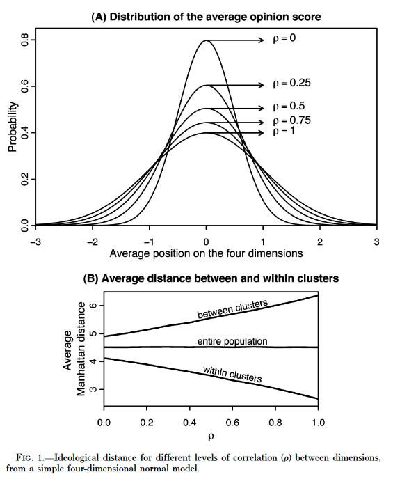
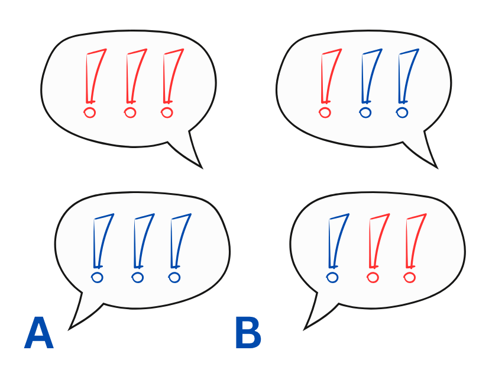
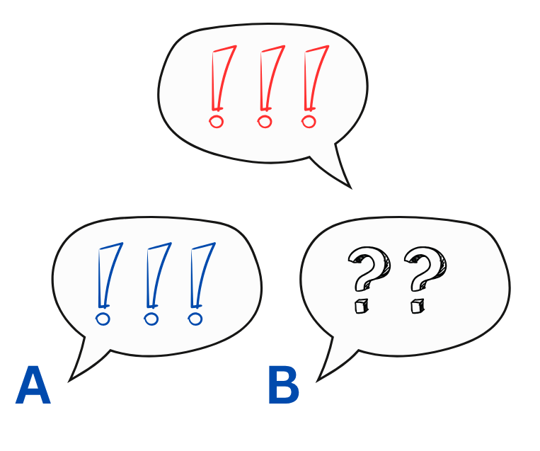
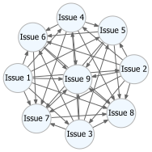
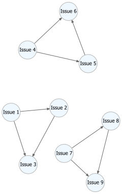
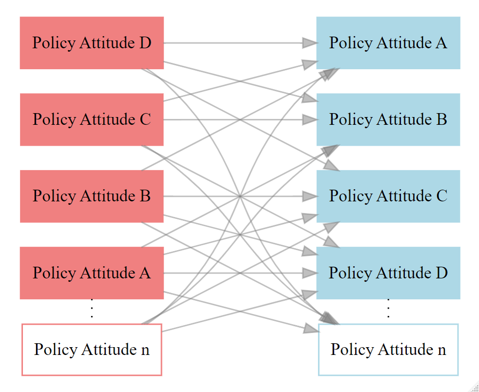
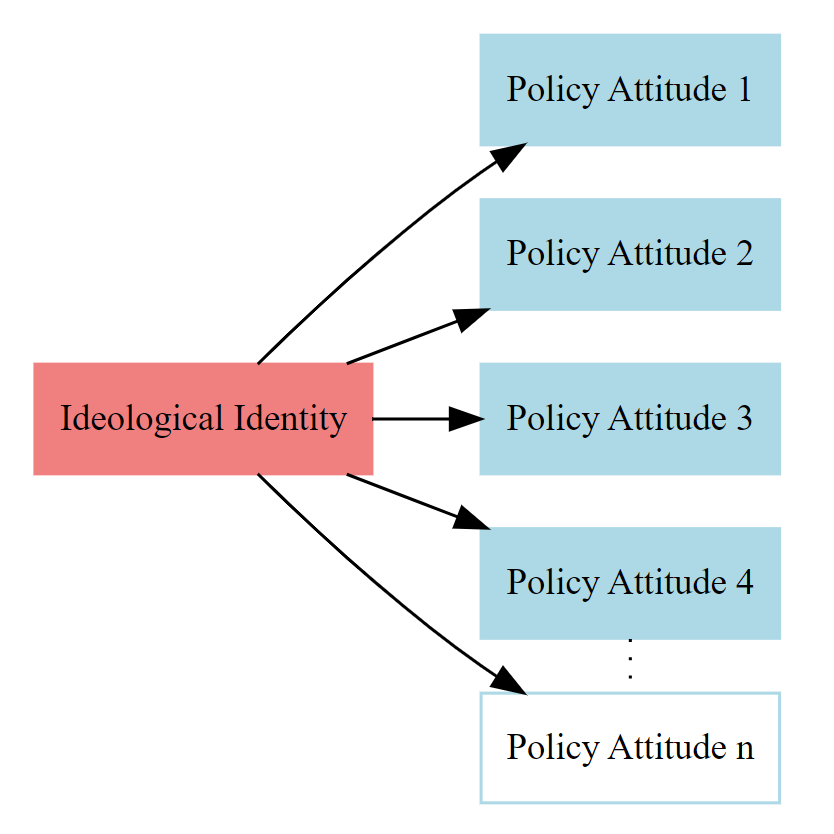

## Public Opinion Polarization

@dimaggio1996

::: {style="max-height: 500px; overflow-y: auto; font-size: 50%"}
| **Conceptual Element** | **Description**                                            | **This Dissertation**                                                                                                                                                                                                                 |
|--------------------------|--------------------|--------------------------|
| **Belief dispersion**  | Extremity of particular political beliefs                  | **Belief dispersion**, Related concepts: *disagreement* (i.e., divergence between individuals on a particular issue) or *extremity* (i.e., a situation in which a group is positioned at an extreme end of a continuum of contention) |
| **Belief constraint**  | Alignment of individual beliefs into comprehensive systems | **Belief Alignment**, The degree to which beliefs on particular issues can be collapsed into fewer ideological dimensions of conflict; with greater alignment, there are correspondingly fewer peaks.                                 |
| **Bimodality**         | Distribution of beliefs with two distinct peaks            | *(Included under Belief Alignment)*                                                                                                                                                                                                   |
| **Consolidation**      | Alignment of beliefs with political identities             | *Neither necessary, nor sufficient condition*, considered outside of the concept                                                                                                                                                      |
:::

## Belief Alignment

```{r, warning=FALSE, label="Alignment_anim"}
library(ggplot2)
library(gganimate)
library(MASS)
library(dplyr)
library(av)
library(patchwork)
library(tidyverse)
library(tibble)
library(purrr)

  set.seed(5)
  
  # Generate the datasets
  df_list <- list()
  for (i in 1:9) {
    corr <- i / 10
    sigma <- matrix(c(1, corr, corr,
                      corr, 1, corr,
                      corr, corr, 1), nrow = 3)
    mu <- c(0, 0, 0)
    df <- as.data.frame(mvrnorm(n = 1000, mu = mu, Sigma = sigma))
    colnames(df) <- c("v1", "v2", "v3")
    df$id <- sprintf("df%02d", i)
    df_list[[i]] <- df
  }
  combined_df <- bind_rows(df_list)
  
  combined_df = combined_df |> mutate(v = v1 + v2 + v3)
  
    combined_df <- combined_df %>%
  mutate(id = paste0("Correlation = ", as.numeric(substr(id, 3, 4)) / 10))
  
  # Compute summary statistics
  summaries <- combined_df %>%
    group_by(id) %>%
    summarise(
      mean_v = mean(v),
      sd_v = sd(v),
      .groups = "drop"
    ) %>%
    mutate(
      label_mean = paste0("Mean = ", round(mean_v, 2)),
      label_sd1 = paste0("+1 SD = ", round(mean_v + sd_v, 2)),
      label_sd2 = paste0("-1 SD = ", round(mean_v - sd_v, 2)),
      label_sd_corner = paste0("SD = ", round(sd_v, 2))
    )
  
  # Merge back
  combined_df <- left_join(combined_df, summaries, by = "id")
  

pair1 <- ggplot(combined_df, aes(v1, v2)) +
    geom_point(fill = "grey30", color = "grey30", size = 1.5, alpha = 0.8) +
    theme_classic() + theme(title = element_text(size = 13),
                            axis.title = element_text(size = 11)) +
    labs(x = "Issue 1", y = "Issue 2") +
    xlim(-5,5) + ylim(-5,5) +
    transition_states(id, wrap = FALSE) +
    ggtitle("{closest_state}")


```

::: columns
::: {.column width="50%"}
```{r, label="Pair1"}
animate(pair1, nframes = 100, fps = 10, width = 525, height = 600, rewind = T, units = "px", res = 110)

```
:::

::: {.column width="50%"}
::: incremental
-   Constraint on idea elements, @converse2006
-   Dimensionality of ideologies, @vannoord2024, @hare2022, @malka2019
    -   **Bimodality**
:::
:::
:::

## Inter-Item Alignment Implies Dispersion on Latent Scale {.smaller}

::: columns
::: {.column width="60%"}
```{r, label = "Dispersion_anim"}

  
  # Plot with lines and numeric labels
  p <- ggplot(combined_df, aes(x = v)) +
    geom_histogram(bins = 30, fill = "steelblue", color = "steelblue", alpha = 0.7) +
    geom_vline(aes(xintercept = mean_v), color = "black", linetype = "dashed", size = 1) +
    geom_vline(aes(xintercept = mean_v + sd_v), color = "grey40", linetype = "solid", size = 0.8) +
    geom_vline(aes(xintercept = mean_v - sd_v), color = "grey40", linetype = "solid", size = 0.8) +
    geom_text(aes(x = mean_v + sd_v, y = 170, label = label_sd1), angle = 90, vjust = -0.5, hjust = 0, size = 2, color = "black") +
    geom_text(aes(x = mean_v - sd_v, y = 170, label = label_sd2), angle = 90, vjust = -0.5, hjust = 0, size = 2, color = "black") +
    geom_text(data = summaries, aes(x = 10, y = 220, label = label_sd_corner), inherit.aes = FALSE, hjust = 0, size = 3) +
    theme_minimal() + theme(text = element_text(size = 11)) + ylim(c(0,250)) + xlim(-15, 15) +
    labs(x = "Ideological Position", y = "") +
    transition_states(id, wrap = FALSE) +
    ggtitle("{closest_state}")
   
  # Animate
  animate(p, nframes = 100, fps = 10, width = 682, height = 600, rewind = T, units = "px")

```
:::

::: {.column width="40%"}
@baldassarri2008

{width="380"}
:::
:::

## Robustness of Opinion Divides

```{r, echo=FALSE, label = "robustness"}
 
 mu <- c(0,0,0,0,0,0,0,0,0,0)
 sigma <- matrix(0.7, nrow = 10, ncol = 10)
 diag(sigma) <- 1
 df2 <- as.data.frame(mvrnorm(n = 1000, mu = mu, Sigma = sigma))

 
 df2$all_same_sign <- apply(df2, 1, function(row) {
   all(row > 0) || all(row < 0)
 }) * 1 
 
 
 var_names <- paste0("V", 1:10)
 var_pairs <- combn(var_names, 2, simplify = FALSE)
 
 df2$id <- 1:nrow(df2)
 df2_long <- pivot_longer(df2, cols = starts_with("V"), names_to = "var", values_to = "value")
 
 # Join long data twice to get all combinations
 df_pairs <- expand.grid(id = 1:nrow(df2), pair = seq_along(var_pairs)) %>%
   mutate(var1 = map_chr(pair, ~ var_pairs[[.x]][1]),
          var2 = map_chr(pair, ~ var_pairs[[.x]][2])) %>%
   left_join(df2_long, by = c("id", "var1" = "var")) %>%
   rename(x = value) %>%
   left_join(df2_long, by = c("id", "var2" = "var")) %>%
   rename(y = value) %>%
   mutate(pair_label = paste0(var1, " vs ", var2))
 
 df_pairs <- df_pairs %>%
   select(-all_same_sign.y) %>%
   rename(all_same_sign = all_same_sign.x) 
 
cor_high <- ggplot(df_pairs, aes(x = x, y = y)) +
  geom_point(aes(color = factor(all_same_sign)), size = 1.5, alpha = 0.6) +
  scale_color_manual(
    values = c("0" = "gray70", "1" = "firebrick4"),
    name = "All Same Sign",
    labels = c("No", "Yes")
  ) + xlim(-5,5) + ylim(-5,5) +
  labs(title = 'Pair: {closest_state}', x = NULL, y = NULL) +
  transition_states(pair_label, transition_length = 2, state_length = 1) +
  ease_aes('linear') + theme_minimal() + theme(legend.position = "none") +
annotate("text", x = 0.5, y = -4.5, hjust = 0, label = "Same Direction: 36.5 %")


mu2 <- c(0,0,0,0,0,0,0,0,0,0)
sigma2 <- matrix(0.3, nrow = 10, ncol = 10)
diag(sigma2) <- 1
df3 <- as.data.frame(mvrnorm(n = 1000, mu = mu2, Sigma = sigma2))


df3$all_same_sign <- apply(df3, 1, function(row) {
  all(row > 0) || all(row < 0)
}) * 1 


df3$id <- 1:nrow(df3)
df3_long <- pivot_longer(df3, cols = starts_with("V"), names_to = "var", values_to = "value")

# Join long data twice to get all combinations
df_pairs2 <- expand.grid(id = 1:nrow(df3), pair = seq_along(var_pairs)) %>%
  mutate(var1 = map_chr(pair, ~ var_pairs[[.x]][1]),
         var2 = map_chr(pair, ~ var_pairs[[.x]][2])) %>%
  left_join(df3_long, by = c("id", "var1" = "var")) %>%
  rename(x = value) %>%
  left_join(df3_long, by = c("id", "var2" = "var")) %>%
  rename(y = value) %>%
  mutate(pair_label = paste0(var1, " vs ", var2))

df_pairs2 <- df_pairs2 %>%
  select(-all_same_sign.y) %>%
  rename(all_same_sign = all_same_sign.x) 

cor_low <- ggplot(df_pairs2, aes(x = x, y = y)) +
  geom_point(aes(color = factor(all_same_sign)), size = 1.5, alpha = 0.6) +
  scale_color_manual(
    values = c("0" = "gray70", "1" = "firebrick4"),
    name = "All Same Sign",
    labels = c("No", "Yes")
  ) + xlim(-5,5) + ylim(-5,5) +
  labs(title = 'Pair: {closest_state}', x = NULL, y = NULL) +
  transition_states(pair_label, transition_length = 2, state_length = 1) +
  ease_aes('linear') + theme_minimal() + theme(legend.position = "none") +
annotate("text", x = 0.5, y = -4.5, hjust = 0, label = "Same Direction: 9.5 %")


```

::: columns
::: {.column width="50%"}
**High Belief Alignment (0.7)**

```{r, label="Cor_high"}
animate(cor_high, nframes = 100, fps = 10, width = 525, height = 600, units = "px", res = 110)

```
:::

::: {.column width="50%"}
**Low Belief Alignment (0.3)**

```{r, label="Cor_low"}
animate(cor_low, nframes = 100, fps = 10, width = 525, height = 600, units = "px", res = 110)

```
:::
:::

## Three Levels of Analysis

::: {style="max-height: 500px; overflow-y: auto; font-size: 50%"}
| **Level of Analysis** | **Alignment**                                                                                                             | **Dispersion**                                                                                           | **(Consolidation)**                                                                                 |
|------------------|------------------|------------------|------------------|
| *Individuals*         | *Ideological Alignment* (USA)<br>Alignment of beliefs along the primary liberal-conservative continuum in the U.S.        | *Disagreement*<br>Degree of attitudinal mismatch between individuals                                     | The aim is to establish the connection without invoking identity-based considerations               |
| *Partisan Camps*      | *Ideological Alignment* (Europe)<br>In European contexts, alignment with ideological orientation in two-dimensional space | *Poles of Ideological Contention*<br>Focus on partisan camps positioned at opposing ideological extremes | *Partisanship*<br>Only individuals with partisan identities are studied                             |
| *Mass Societies*      | *Issue Alignment*<br>Opinions collapsing into fewer, coherent ideological worldviews in predefined direction              | Using the same measurement, these worldviews exhibit increased divergence                                | *Ideological Identity Alignment*<br>Alignment of opinions with self-reported ideological identities |
:::

# Individuals

## Research Question

-   *Is ideological disagreement different?*
    -   For animosity
    -   Nature of disagreement
-   Affective Polarization -\> **'Other Divide'**, @krupnikov2022
-   Recognizable structures in abundance of policies, @converse2006
-   Being an ideologue as cognitive shortcut, @lau2001, @kahneman2013

::: aside
This part was published in [**Political Behavior**](https://doi.org/10.1007/s11109-025-10049-z)
:::

## Disagreement Among Ideologues

::: columns
::: {.column width="50%"}
**Belief Alignment**

{width="380"}
:::

::: {.column width="50%"}
**Opinionatedness**

{width="380"}
:::
:::

## Analysis {.smaller}

::: columns
::: {.column width="50%"}
#### Methods

-   Survey experiments with repeated hypothetical profiles
-   Profiles mirroring responses
-   2x 2000 US respondents (YouGov, PRL)
-   Study 1 (DV): Feeling Thermometer
-   Study 2 (DV): Expected disagreement
:::

::: {.column width="50%"}
#### Results

::: {.callout-note icon="false"}
## Overview

1.  Disagreement with an opinionated counterpart elicits up to **4× more animosity**.

2.  Ideologues show stronger affective reactions—liking similar-minded people more and disliking different-minded people more—with a **51-point difference**, compared to **19 points** for non-ideologues.

3.  Ideologues, especially the politically sophisticated, **expect more disagreement** from different-minded vignettes and more agreement from similar-minded ones.
:::
:::
:::

# Partisan Camps

## Asymmetry Hypothesis {.smaller}

*Are all ideologically distinctive partisan camps equally ideologically aligned?*

#### Cross-pressured individuals and asymmetry in alignment

-   Cross-pressured individuals lean to the right, @baldassarri2014, @gidronManyWaysBe2022

-   Other motivations for conservatism than policy, @jost2009

\vspace{0.5cm}

#### Cleavages and party ideologies

-   Heterogeneous support for radical right, @oesch2018, @kitschelt2005

-   Over-emphasizing immigration, @kirkizh2023, @bustikova2014

::: aside
This part was published in [**European Journal of Political Research**](https://doi.org/10.1111/1475-6765.70016)
:::

## Implications of Asymmetry {.smaller}

**Partisan disagreement**

-   Robust to agenda change

-   More extensive if both aligned

::: {layout="[50,50]" layout-valign="top"}



:::

## Analysis {.smaller}

::: columns
::: {.column width="50%"}
#### Methods

-   Partisan alignment with party's ideological orientation [^1]

-   DV (within countries): as the number of aligned attitudes

-   DV (across countries): as the interconnectedness of beliefs

    -   Belief network estimation & comparisons, party families

    -   Partial correlations, GEI = sum
:::

::: {.column width="50%"}
#### Results

::: {.callout-note icon="false"}
## Overview

1.  Supporters of right-wing parties were less aligned with conservative ideologies in 2008 (**asymmetry**).

2.  By **2016**, alignment became **symmetrical in the sociocultural** ideological domain.

3.  Supporters of left-wing party families are more heterogeneous in their beliefs than those of right-wing party families **across Europe**.
:::
:::
:::

[^1]: i.e., do supporters of culturally conservative parties hold culturally conservative beliefs, and do supporters of economically left-wing parties hold left-wing economic views?

# Societies

## Sources of Culture Wars {.smaller}

*Why do some societies seem to be embroiled in culture wars, while others are not?*

### Religious Cultures

Cultures instead of denominations, differences in social norms and beliefs, @norris2011, @lipset1967

Persistent on the party level, @rovny2019, in economic beliefs, @stegmueller2013

### Development

Postmaterialistic priorities, economic scarcity @inglehart1971

Socialization into (post)materialistic conflict @flanagan2003, @schäfer2022, @ogrady2022

::: aside
This part was published in [**European Union Politics**](https://doi.org/10.1177/14651165251320882)
:::

## Analysis {.smaller}

::: columns
::: {.column width="50%"}
#### Methods

::: {.panel-tabset .nav-pills}
## Issue Alignment

{width="400"}

## Ideological Identity Alignment

{width="350"}
:::
:::

::: {.column width="50%"}
#### Results

::: {.callout-note icon="false"}
## Overview

1.  There are few differences in culture war attitudes between the least and most developed countries.

2.  However, there are s**ubstantial differences between Protestant and Catholic countries**—differences that persist even among younger cohorts.

3.  These differences are especially pronounced in how **moral issues relate to each other**, how **they connect to ideological identities**, and in the comparatively lower alignment on **economic issues** .
:::
:::
:::

# Implications

## Dangers of Ideological Worldviews {.smaller}

1.  Beliefs structured by ideological worldviews are particularly problematic in times of polarization, as ideology fosters both disagreement and animosity
2.  The sources of such alignment are varied — rooted in culture or shaped by homogeneity and motivation within individual partisan camps

### What now?

-   Partisan sorting, increasing ideological constraint over time, and the construction of ideological narratives serve to extend conflict rather than displace it

-   At the individual level: perceived conflict extent, deep partisan involvement, in-group favoritism, animosity, and intolerance, psychological underpinnings of it

## References

::: {#refs}
:::
